# Lab 1 - Infrastructure is Code

## Introduction

[World Wide Importers (WWI)](https://docs.microsoft.com/en-us/sql/sample/world-wide-importers/overview) is a (fictitious) wholesale novelty goods importer and distributor operating from the San Francisco bay area.

As a wholesaler, WWI’s customers are mostly companies who resell to individuals. WWI sells to retail customers across Europe including specialty stores, supermarkets, computing stores, tourist attraction shops, and some individuals. WWI also sells to other wholesalers via a network of agents who promote the products on WWI’s behalf. While all of WWI’s customers are currently based in Europe, the company is intending to push for expansion into other parts of the world.

Currently, WWI is running its ERP system in their own computer room. Some years ago, WWI has switched to VMs on various Hyper-V servers for running their ERP system. The servers and the installed software are manually maintained by WWI's administrators. They use remote desktop to connect to the servers, install OS patches, install patches for the ERP system, etc. A recent survey unveiled the following problems of this strategy:

1. Business departments complain that implementing and deploying urgent new features in the ERP system takes too long.
1. It often takes quite long to fix bugs because finding the root cause is difficult (e.g. is it an infrastructure or code problem?).
1. Testers would need test environments more frequently and faster. IT administrators cannot cope with the number of requests for new test environments.
1. WWI's IT cannot provide SLAs (availability and performance) necessary for a company that has grown to the size that WWI is today.
1. Rolling out the ERP system to many new countries seems impossible with WWI's current IT strategy.

> Discuss what WWI should change in terms of IT organization and DevOps.

## Conclusions

* WWI wants to use *Azure* to free resources allocated by running the local server infrastructure.
* WWI wants to use *PaaS* as much as possible to eliminate effort necessary for running an maintaining base components (e.g. OS, DB, etc.)
* Automation culture:
  * WWI wants to automate administrative IT tasks to make them repeatable and reduce human errors.
  * Developers of WWI want to automate the build, test, and deploy steps to make them repeatable and reduce human errors.

## Infrastructure is Code

In this lab, we are going to automate resource management with [*Azure Resource Manager* templates](https://docs.microsoft.com/en-us/azure/azure-resource-manager/resource-group-overview#template-deployment). In order to do this lab, you need the following prerequisites:

* Azure subscription in which you can create and manage resource groups and their content.
* [Azure PowerShell](https://docs.microsoft.com/en-us/powershell/azure/overview)
  * We recommend writing and running the PowerShell code in this lab using [PowerShell ISE](https://docs.microsoft.com/en-us/powershell/scripting/introducing-the-windows-powershell-ise?view=powershell-6)
* [Visual Studio Code](https://code.visualstudio.com); install the following extensions:
  * [Azure Resource Manager Tools](https://marketplace.visualstudio.com/items?itemName=msazurermtools.azurerm-vscode-tools)

> Note to presenters: If you have limited time, skip building the ARM Template step-by-step. Open the [ready-made template](erp.json) and just do a code walkthrough.


### Create Basic Structure of ARM Template

* Create an empty folder in which you can store all the files of this lab.
* Open the folder in *Visual Studio Code*
* Create a new *ARM Template* file called `erp.json` (we are deploying an ERP system, hence the name).
* Add the following basic structure for our template:

```
{
    "$schema": "http://schema.management.azure.com/schemas/2015-01-01/deploymentTemplate.json#",
    "contentVersion": "1.0.0.0",
    "parameters": {  },
    "variables": {  },
    "resources": [  ],
    "outputs": {  }
}
```

* Read more about the [format of *ARM Templates*...](https://docs.microsoft.com/en-us/azure/azure-resource-manager/resource-group-authoring-templates#template-format)


### Create Parameters

* Add the following parameters to the `parameters` section. These parameter help to keep your template reusable:

```
"parameters": {
    "dbAdminUser": {
        "type": "string",
        "defaultValue": "demo",
        "metadata": {
            "description": "The administrator login for the created SQL Server."
        }
    },
    "dbAdminPassword": {
        "type": "securestring",
        "metadata": {
            "description": "The SQL Server's administrator password."
        }
    },
    "environment": {
        "type": "string",
        "allowedValues": [
            "dev",
            "stg",
            "prod"
        ],
        "defaultValue": "dev",
        "metadata": {
            "description": "The environment you want to deploy."
        }
    },
    "databaseEdition": {
        "type": "string",
        "allowedValues": [
            "Basic",
            "Standard",
            "Premium"
        ],
        "defaultValue": "Standard",
        "metadata": {
            "description": "The database edition"
        }
    }
}
```

* Read more about [*ARM Template Parameters*...](https://docs.microsoft.com/en-us/azure/azure-resource-manager/resource-group-authoring-templates#parameters)
* Read more about [best practices regarding *ARM Template Parameters*...](https://docs.microsoft.com/en-us/azure/azure-resource-manager/resource-manager-template-best-practices#parameters)

> Note to presenters: Speak about the importance of parameters for interactive deployments. Use e.g. the *Deploy to Azure* button in e.g. an [Azure Quickstart template](https://github.com/Azure/azure-quickstart-templates/tree/master/201-web-app-blob-connection) to demonstrate the point.


### Create Variables

* As always in programming: Don't repeat yourself. Store values that are needed throughout your template in variables. Therefore, add the following code to the `variables` section:

```
"variables": {
    "namePrefix": "wwi",
    "sqlServerName": "[concat(variables('namePrefix'), 'sql', parameters('environment'), uniqueString(resourceGroup().id))]",
    "sqlDbName": "[concat('sql', parameters('environment'), 'erp01')]",
    "webFarmName": "[concat(variables('namePrefix'), 'webfarm', parameters('environment'), uniqueString(resourceGroup().id))]",
    "webAppName": "[concat(variables('namePrefix'), 'web', parameters('environment'), uniqueString(resourceGroup().id))]",
    "webAppSlotName": "staging",
    "appInsightsName": "[concat(variables('namePrefix'), 'ai', parameters('environment'), uniqueString(resourceGroup().id))]",
    "location": "[resourceGroup().location]",
    "webDeployUser": "publisher"
}
```

* Read more about [*ARM Template Variables*...](https://docs.microsoft.com/en-us/azure/azure-resource-manager/resource-group-authoring-templates#variables)
* Read more about [best practices regarding *ARM Template Variables*...](https://docs.microsoft.com/en-us/azure/azure-resource-manager/resource-manager-template-best-practices#variables)
* Read more about [*ARM Template Functions*](https://docs.microsoft.com/en-us/azure/azure-resource-manager/resource-group-template-functions) like `concat` and `uniqueString`...
* Read more about [best practices for resource names...](https://docs.microsoft.com/en-us/azure/azure-resource-manager/resource-manager-template-best-practices#resource-names)


### Creating *Azure SQL* Resources

* We are ready to create our first resources. Let's start with an *Azure SQL* server and database. Add the following code into the `resources` array of your template:

```
{
    "name": "[variables('sqlServerName')]",
    "type": "Microsoft.Sql/servers",
    "apiVersion": "2014-04-01",
    "location": "[variables('location')]",
    "tags": {
        "Project": "Intelligent Apps Workshop",
        "Tier": "Database",
        "Environment": "[parameters('environment')]"
    },
    "properties": {
        "administratorLogin": "[parameters('dbAdminUser')]",
        "administratorLoginPassword": "[parameters('dbAdminPassword')]"
    },
    "resources": [
        {
            "name": "AllowAllIps",
            "type": "firewallRules",
            "apiVersion": "2014-04-01",
            "dependsOn": [
                "[concat('Microsoft.Sql/servers/', variables('sqlServerName'))]"
            ],
            "properties": {
                "startIpAddress": "0.0.0.0",
                "endIpAddress": "255.255.255.255"
            }
        },
        {
            "name": "AllowAzureInternalIPs",
            "type": "firewallRules",
            "apiVersion": "2014-04-01",
            "dependsOn": [
                "[concat('Microsoft.Sql/servers/', variables('sqlServerName'))]"
            ],
            "properties": {
                "startIpAddress": "0.0.0.0",
                "endIpAddress": "0.0.0.0"
            }
        },
        {
            "name": "[variables('sqlDbName')]",
            "type": "databases",
            "apiVersion": "2014-04-01",
            "location": "[variables('location')]",
            "dependsOn": [
                "[variables('sqlServerName')]"
            ],
            "tags": {
                "Project": "Intelligent Apps Workshop",
                "Tier": "Database",
                "Environment": "[parameters('environment')]"
            },
            "properties": {
                "edition": "[parameters('databaseEdition')]"
            }
        }
    ]
}
```

* Note IntelliSense when using *Visual Studio Code* to edit your template file
* Note the nesting of resource (e.g. *Firewall Rules* inside of `resources` of the *Azure SQL Server*)
* Read more about [*SQL resources* in template...](https://docs.microsoft.com/en-us/azure/templates/microsoft.sql/servers)
* Take a look at the [*ARM Schemas* in GitHub...](https://github.com/Azure/azure-resource-manager-schemas/tree/master/schemas/2014-04-01)

> Note to presenters: Emphasize that ARM is not specifically for *IaaS* or *PaaS*. It can create *any* kind of resource available in Azure, independent of its IaaS- or PaaS-nature.


### Creating *Application Insights* Resource

* Next, we want to add an *Application Insights* resource. Add the following code into the `resources` array of your template:

```
{
    "name": "[variables('appInsightsName')]",
    "type": "microsoft.insights/components",
    "apiVersion": "2015-05-01",
    "location": "[variables('location')]",
    "tags": {
        "Project": "Intelligent Apps Workshop",
        "Tier": "Web",
        "Environment": "[parameters('environment')]"
    },
    "properties": {
        "Application_Type": "web"
    }
}
```

* Read more about [*Application Insights resources* in template...](https://docs.microsoft.com/en-us/azure/templates/microsoft.insights/components)


### Creating *App Service* Resources

* We want to deploy a web app. For that, we need an *App Service Plan*. Add the following code into the `resources` array of your template:

```
{
    "name": "[variables('webFarmName')]",
    "type": "Microsoft.Web/serverfarms",
    "apiVersion": "2016-09-01",
    "location": "[variables('location')]",
    "tags": {
        "Project": "Intelligent Apps Workshop",
        "Tier": "Web",
        "Environment": "[parameters('environment')]"
    },
    "properties": {
        "name": "[variables('webFarmName')]"
    },
    "sku": {
        "name": "S1",
        "tier": "Standard",
        "size": "S1",
        "family": "S",
        "capacity": 1
    }
}
```

* Read more about [*Serverfarm* resources in template...](https://docs.microsoft.com/en-us/azure/templates/microsoft.web/serverfarms)


### Creating *Web App* Resources

* Now we have all we need to finally deploy the web app. Add the following code into the `resources` array of your template:

```
{
    "name": "[variables('webAppName')]",
    "type": "Microsoft.Web/sites",
    "apiVersion": "2016-08-01",
    "location": "[variables('location')]",
    "tags": {
        "Project": "Intelligent Apps Workshop",
        "Tier": "Web",
        "Environment": "[parameters('environment')]"
    },
    "dependsOn": [
        "[variables('appInsightsName')]",
        "[variables('webFarmName')]"
    ],
    "properties": {
        "serverFarmId": "[resourceId('Microsoft.Web/serverfarms/', variables('webFarmName'))]",
        "siteConfig": {
            "defaultDocuments": [
                "default.html"
            ],
            "netFrameworkVersion": "v4.6",
            "publishingUsername": "[variables('webDeployUser')]",
            "appSettings": [
                {
                    "name": "ApplicationInsights:InstrumentationKey",
                    "value": "[reference(resourceId('Microsoft.Insights/components', variables('appInsightsName')), '2015-05-01').InstrumentationKey]"
                },
                {
                    "name": "ConnectionStrings:DB",
                    "value": "[concat('Server=tcp:', variables('sqlServerName'),'.database.windows.net,1433;Initial Catalog=', variables('sqlDbName'), ';Persist Security Info=False;User ID=', parameters('dbAdminUser'), ';Password=', parameters('dbAdminPassword'), ';MultipleActiveResultSets=False;Encrypt=True;TrustServerCertificate=False;Connection Timeout=30;')]"
                }
            ],
            "use32BitWorkerProcess": false,
            "webSocketsEnabled": true,
            "alwaysOn": true,
            "cors": {
                "allowedOrigins": [
                    "*"
                ]
            }
        }
    },
    "resources": [
        {
            "name": "[variables('webAppSlotName')]",
            "type": "slots",
            "apiVersion": "2016-08-01",
            "location": "[variables('location')]",
            "tags": {
                "Project": "Intelligent Apps Workshop",
                "Tier": "Web",
                "Environment": "[parameters('environment')]"
            },
            "dependsOn": [
                "[variables('appInsightsName')]",
                "[variables('webAppName')]"
            ],
            "properties": {
                "siteConfig": {
                    "defaultDocuments": [
                        "default.html"
                    ],
                    "netFrameworkVersion": "v4.6",
                    "publishingUsername": "[variables('webDeployUser')]",
                    "appSettings": [
                        {
                            "name": "ApplicationInsights:InstrumentationKey",
                            "value": "[reference(resourceId('Microsoft.Insights/components', variables('appInsightsName')), '2015-05-01').InstrumentationKey]"
                        },
                        {
                            "name": "ConnectionStrings:DB",
                            "value": "[concat('Server=tcp:', variables('sqlServerName'),'.database.windows.net,1433;Initial Catalog=', variables('sqlDbName'), ';Persist Security Info=False;User ID=', parameters('dbAdminUser'), ';Password=', parameters('dbAdminPassword'), ';MultipleActiveResultSets=False;Encrypt=True;TrustServerCertificate=False;Connection Timeout=30;')]"
                        }
                    ],
                    "use32BitWorkerProcess": false,
                    "webSocketsEnabled": true,
                    "alwaysOn": true,
                    "cors": {
                        "allowedOrigins": [
                            "*"
                        ]
                    }
                }
            },
            "resources": []
        }
    ]
}
```

* Note how we add application configuration for dependent resources (DB, Application Insights)
* Read more about [*Web Site* resources in template...](https://docs.microsoft.com/en-us/azure/templates/microsoft.web/sites)

> Note to presenters: Describe the concept of [*Deployment Slots* in *App Service*](https://docs.microsoft.com/en-us/azure/app-service-web/web-sites-staged-publishing) and why it is important in a DevOps world.


### Deploy Template with PowerShell

**Note that running the script shown below will create resources in Azure which are subject to a charge. Don't forget to delete them when you no longer need them. However, don't delete them too early as subsequent exercises in this training use the results of this lab.**

* Open *PowerShell ISE*
* Add the following code to a script called `deploy.ps1`:

```
# Check if user is already signed in
Try {
  Get-AzureRmContext | Out-Null
} Catch {
  if ($_ -like "*Login-AzureRmAccount to login*") {
    Login-AzureRmAccount
  }
}

# Select subscription where name contains `MSDN Subscription`
Get-AzureRmSubscription | where { $_.SubscriptionName -like "*MSDN Subscription*" } | Select-AzureRmSubscription

# Set some string constants
$rg = "intel-app-workshop2"
$location = "westeurope"
$dep = "Deployment-" + [guid]::NewGuid()
$path = "C:\Code\GitHub\msft-intelligent-app-workshop\Exercises\exercise1-devops\"
$vaultName = "wwikvdev01"
$dbAdminUser = "demo"

# Check if resource group already exists
$group = Get-AzureRmResourceGroup -Name $rg -ErrorAction SilentlyContinue
if (!$group) {
    New-AzureRmResourceGroup -Name $rg -Location $location

    # Ask for username and password and store it in KeyVault
    New-AzureRmKeyVault -VaultName $vaultName -ResourceGroupName $rg -Location "westeurope" | Out-Null
    Set-AzureKeyVaultSecret -VaultName $vaultName -Name "SqlAdminPassword" -SecretValue (Get-Credential).Password | Out-Null
}

# Get username and password from KeyVault
$password = Get-AzureKeyVaultSecret -VaultName $vaultName -Name "SqlAdminPassword"
$cred = New-Object -TypeName System.Management.Automation.PSCredential -ArgumentList ($dbAdminUser, $password.SecretValue)  

# Deploy ARM template
New-AzureRmResourceGroupDeployment -ResourceGroupName $rg -TemplateFile "$path\erp.json" `
    -Name $dep -dbAdminUser $dbAdminUser -dbAdminPassword $cred.Password
```

* Execute the script and watch how ARM creates your resources.
* Read more about [Azure PowerShell...](https://docs.microsoft.com/en-us/powershell/azure/overview)

> Note to presenters: Describe the importance of [*KeyVault*](https://azure.microsoft.com/en-us/services/key-vault/) as a secure location to store passwords.


# Lab 2 - Continuous Integration

## Introduction

In the past, WWI has used C# and the .NET Framework to develop its ERP system. A few years ago, the software development team at WWI installed a Microsoft *Team Foundation Server* for source code control. The build and release processes are not automated. Developers build new releases on their developer machines. Deployment is done manually by copying files to the web server.

In the last year, WWI has increasingly been hiring external contractors for doing development work. They are typically not working on-site. They work at home or offices of partner companies. The externals access WWI's networking using a VPN connection. Through this VPN, they can access WWI's TFS.

In a workshop, WWI's developers gathered the following major problems with their current workflow:

1. Human mistakes led to quite a few problems with new releases. Building and releasing new versions is generally quite error-prone. Therefore, the development teams considers reducing the number of new release from one release per quarter to one release per year.
1. External developers constantly complain about VPN problems. WWI's Cyber Security department wants to limit access permissions to the network and to WWI servers to the absolute minimum. Frequently, necessary permissions get taken away or questioned.
1. Testing is a manual process at WWI. More testers would be urgently needed but HR budget is very limited.
1. Only two persons in the team know exactly what to do to deploy new versions. If they are sick, deploying new versions is very risky.
1. TFS is quite outdated as nobody in the team finds the time to update TFS.
1. Another development team responsible for WWI's website already uses Docker on Linux and is very happy with it. The .NET development team would like to try Docker, too. For that, they would have to use Linux instead of Windows.

> Discuss what WWI should change in terms of build and release management.

## Conclusions

* Switch to *Visual Studio Team Services* to free resources from manual TFS maintenance.
* Use *Git* to better support distributed development work.
* Automate the build and release process.
* Add automated tests to reduce the necessary manual testing work.
* Switch to .NET Core to enable running WWI's ERP system on Linux and Docker.

> Note to presenters: Depending on the audience, you can do a quick recap about .NET Core and/or Git.


## Continuous Integration and Deployment

WWI is developing a new ERP solution with *.NET Core 2.0*. Following best DevOps principles, WWI wants to continuously integrate (CI) and continuously deploy (CD) new versions. In this lab, we are going to setup the CI/CD process with [*Visual Studio Team Services*](https://www.visualstudio.com/team-services/) (VSTS).


### Create Project in VSTS

* If you don't have a VSTS account yet, open the [VSTS website](https://www.visualstudio.com/team-services/) and create an account.
* Once you have an account, create a new project:

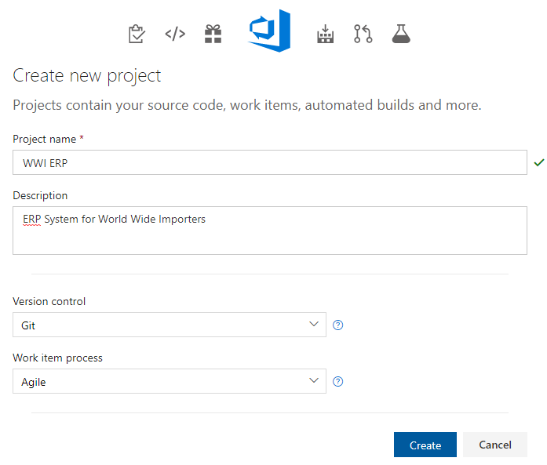


### Create Build Definition

* Create a new *build definition*:

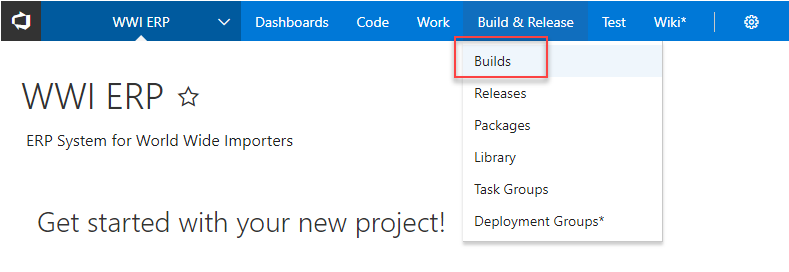

* Select the *ASP.NET Core* template. It will do most of the work for us.

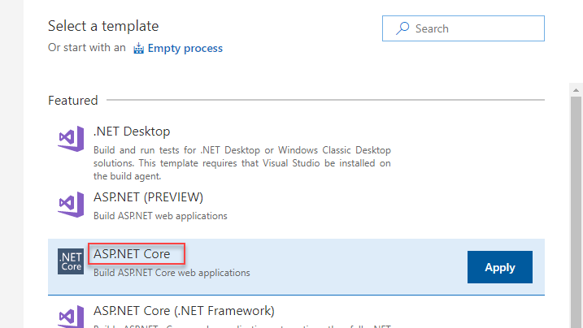

* You can use the GitHub repository for this workshop as the source for the build process. For this, switch to the *Get sources* section, select *Remote repo* and enter [https://github.com/software-architects/msft-intelligent-app-workshop.git](https://github.com/software-architects/msft-intelligent-app-workshop.git) as the *Server Url*:

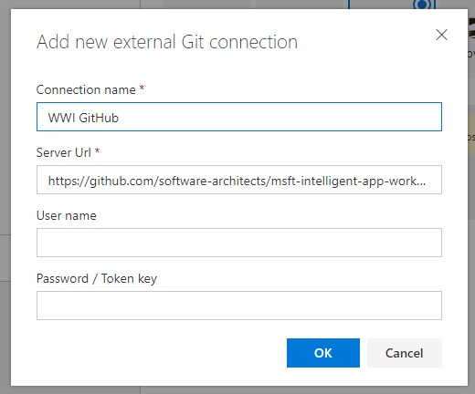

* Set the build options as follows to make sure that the right projects from the GitHub repository are built.

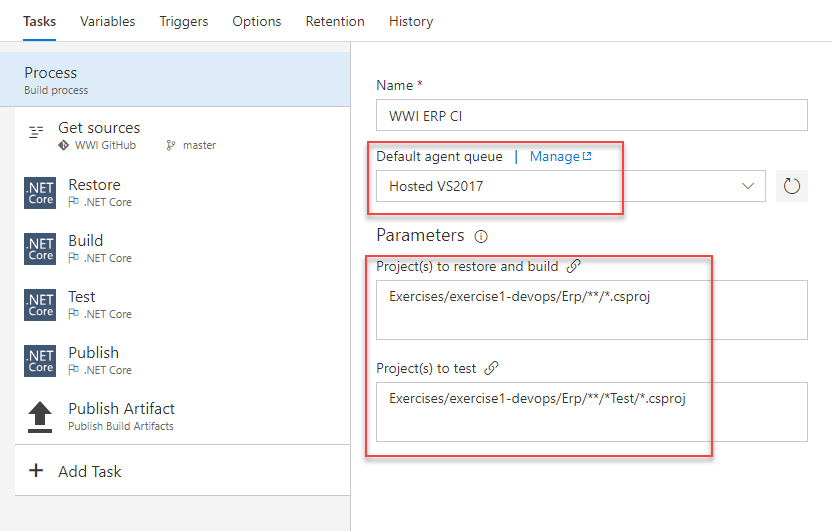

* Last but not least we have to tweak the *Publish* step a little bit. We don't want VSTS to auto-detect the web projects. It would not recognize the web project in our sample as we are building a Web API without a *web.config* file and without *wwwroot* folder.

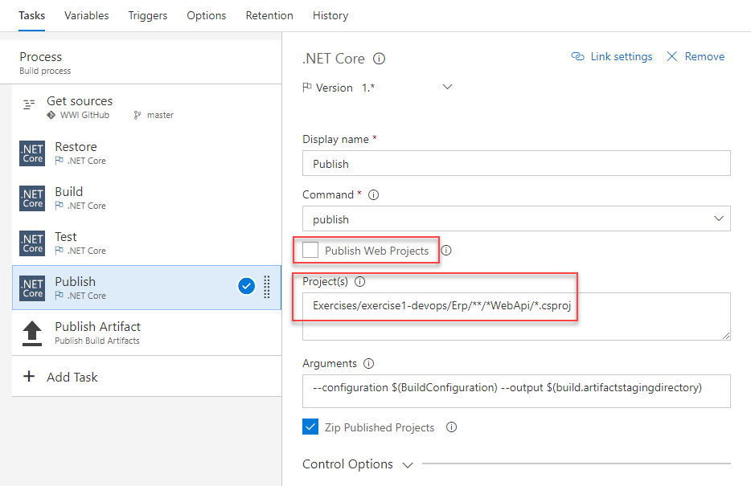

> Note to presenters: Speak about *Triggers* that can be used to start scheduled builds or to trigger builds whenever code changes.

* That's it. Try the build process by hitting the *Save & queue" button in the upper right corner of the screen. The build should successfully finish in a few minutes.

> Note to presenters: Once the build has been started, show the participants how to monitor builds, view build results, browse build artifacts etc. Also speak about the possibility to associate checkins with work items and builds to enhance traceability.

* As .NET Core is used, you can optionally switch to the *Hosted Linux* build agent and run the build process on Linux instead of Windows. The Web API will be built successfully on Linux, too. For that, you don't have to change anything on your build definition.

> Note to presenters: Show switching to Linux only if you have enough time. In shorter workshops, just mention hosted build on Linux and maybe show the screenshot below to illustrate the point.

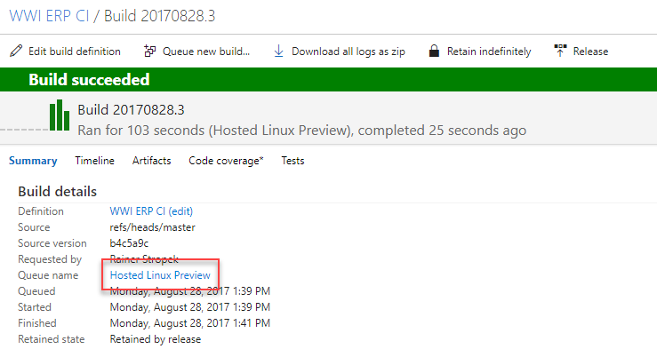

* Read more about [Continuous integration and deployment...](https://www.visualstudio.com/en-us/docs/build/overview)
* Read more about the [available build and release tasks...](https://www.visualstudio.com/en-us/docs/build/define/build)


### Create Release Definition

* Next, we want to automate the deployment. For that, we have to link our VSTS project with our Azure subscription. This is done in the *Services* section of the options:

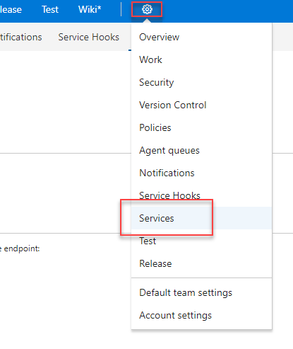

* Create a new service for *Azure Resource Manager* and select **the Azure subscription that you used in Lab 1 (*Azure Resource Manager*)**:

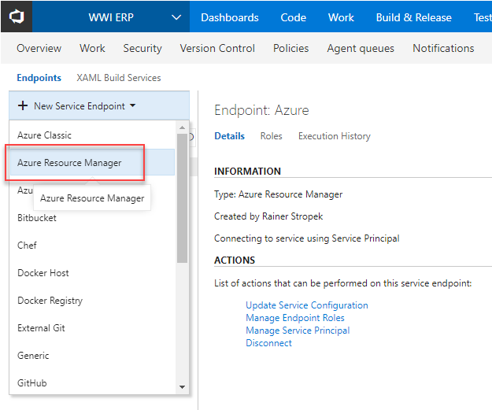

> Note to presenters: Speak about how VSTS creates a *Service Principal* to access Azure.

* Once VSTS and Azure are connected, switch to *VSTS Release Management*:


* Create a new release definition. Use the *Azure App Service Deployment with Slot* as your template:

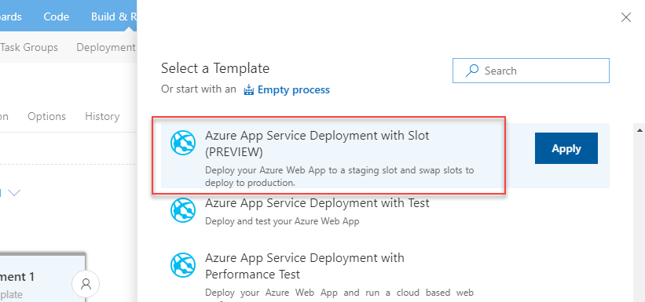

* Change the release definition so that it...
  * ...publishes our Web API to the staging slot.
  * ...asks the product owner (=a VSTS user) for her approval. This gives here the possibility to do final tests before the release goes live.
  * ...swaps staging and production slot.

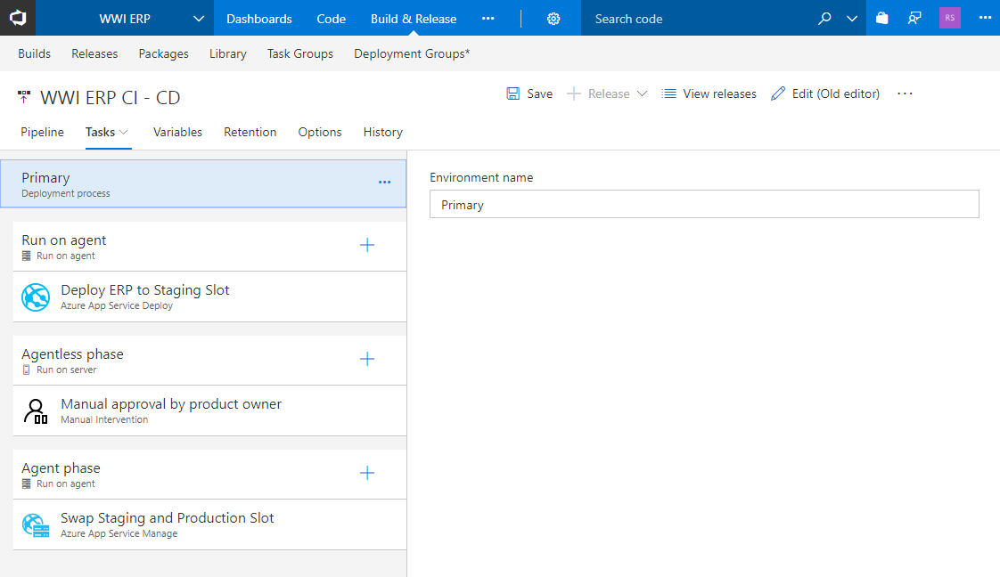

* Save your definition and create a release.

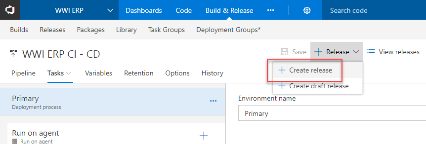

* You will receive an email regarding approval of the new release:

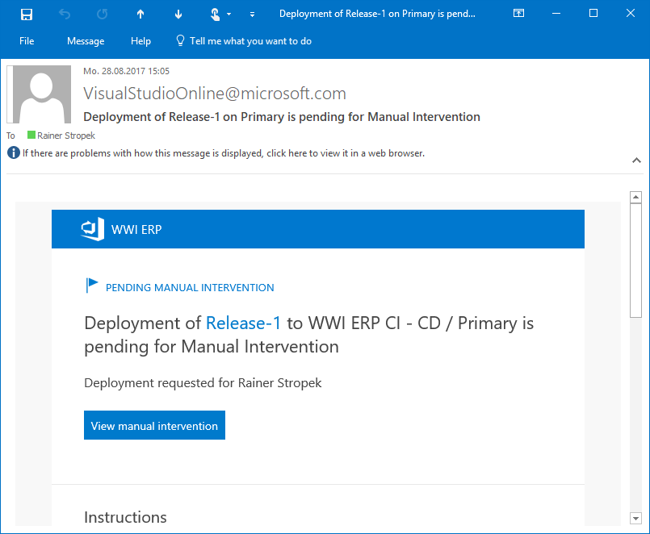

* Before you approve the new release, you can test it e.g. with an interactive REST client. Here are two sample requests that you can try (note that you have to change the server names to the names for your deployment):

```
GET https://wwiwebdevmflhjpyh6tmfk-staging.azurewebsites.net/api/orders HTTP/1.1
Accept: application/json

###

POST https://wwiwebdevmflhjpyh6tmfk-staging.azurewebsites.net/api/orders HTTP/1.1
Content-Type: application/json
Accept: application/json

{
    "customer": "Foo Bar Ltd.",
    "product": "Acme tool 3000",
    "amount": 5,
    "unitPrice": 42.42,
    "totalAmount": 212.10
}
```

> Note to presenters: You can find the requests in the file [Erp/requests.http]. Use the [Visual Studio Code REST Client Plugin](https://marketplace.visualstudio.com/items?itemName=humao.rest-client) to execute them interactively.

* Once you have successfully testes the new release in the staging area, you can approve the new release:

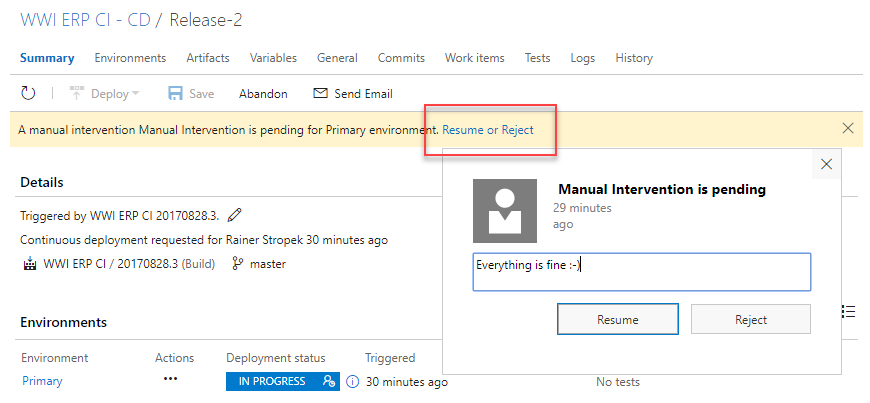

* VSTS Release Management will swap the slots and the new version is live.

* Read more about [Continuous integration and deployment...](https://www.visualstudio.com/en-us/docs/build/overview)
* Read more about the [available build and release tasks...](https://www.visualstudio.com/en-us/docs/build/define/build)
