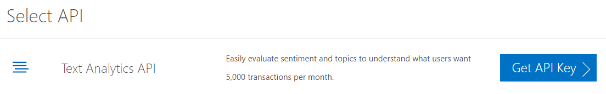
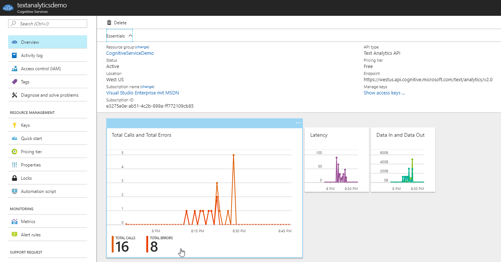
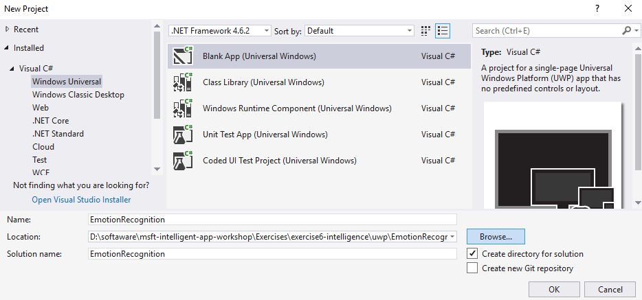
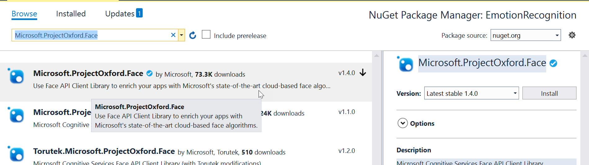
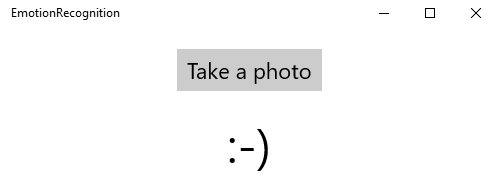

# Lab 1: Consuming Cognitive Services from Java

## Introduction
WWI gets a lot of support tickets every day. Currently, they are fixed just one by one - the first ticket that comes in gets answered first. Sometimes, customers are really upset because of the long response times, even on high priority tickets.

The "WWI Innovation team" thinks of new ways of prioritizing tickets, maybe using machine learning. When talking to the developers they hear that there is currently no knowledge about machine learning or artificial intelligence internally available.

> Show some of the demos on the [Cognitive Services website](https://azure.microsoft.com/de-de/services/cognitive-services/) and discuss the availabilty of machine learning algorithms to "common" software developers.

## Conclusions
WWI wants to create a prototype to analyze support tickets in terms of its sentiment: very emotional tickets should be handled first. As the code base is in Java, they want to access the Cognitive Services from there.

## Requirements
* We will create a small Java application, therefore we need to fulfill some requirements.
* Install the [Java JDK](http://www.oracle.com/technetwork/java/javase/downloads/jdk8-downloads-2133151.html)
* Install [Visual Studio Code](https://code.visualstudio.com) as our IDE.
* Install two Visual Studio Code extensions to get ready:
  * [Language Support for Java(TM) by Red Hat](https://marketplace.visualstudio.com/items?itemName=redhat.java)
  * [Java Debug Extension for Visual Studio Code](https://marketplace.visualstudio.com/items?itemName=vscjava.vscode-java-debug)


## Create an API key
* We'll use the [Text Analytics API](https://westus.dev.cognitive.microsoft.com/docs/services/TextAnalytics.V2.0/operations/56f30ceeeda5650db055a3c9) to make a sentiment analysis of a given support ticket.
* Try out the [online demo](https://azure.microsoft.com/en-us/services/cognitive-services/text-analytics/)
* Get a free [API Key](https://azure.microsoft.com/en-us/try/cognitive-services/?api=text-analytics) for 5,000 transactions per month.



* The API keys can also be purchased and configured in the Azure portal.



## Create your Java application
* Create a *lib*, a *bin* and a *src* folder.
* Copy all the libraries of the (lib)[lib] folder. We'll need those libraries for accessing HTTP services and for serializing/deserializing JSON messages.
* Our POST request to the [Text Analytics API](https://westus.dev.cognitive.microsoft.com/docs/services/TextAnalytics.V2.0/operations/56f30ceeeda5650db055a3c9) expects the following JSON structure in the body:

```json
{
  "documents": [
    {
      "language": "string",
      "id": "string",
      "text": "string"
    }
  ]
}
```

* Let's create Java classes for this structure. First create a *Document.java* file in the *src* folder.

```java
public class Document {
    private String id;
    private String text;

    public String getId() {
        return this.id;
    }

    public String getText() {
        return this.text;
    }

    public Document(String id, String text){
        this.id = id;
        this.text = text;
    }
}
```

* Second create a *Documents.java* file, also in the *src* folder.

```java
import java.util.ArrayList;
import java.util.List;

public class Documents {
    private List<Document> documents;

    public Documents() {
        this.documents = new ArrayList<Document>();
    }

    public List<Document> getDocuments() {
        return this.documents;
    }

    public void add(String id, String text) {
        this.documents.add (new Document (id, text));
    }
}
```

* Next we'll create a class called *TextAnalyzer* that is responsible for sending the HTTP requests to the Text Analytics API.

```java
import java.net.URI;
import org.apache.http.HttpEntity;
import org.apache.http.HttpResponse;
import org.apache.http.client.HttpClient;
import org.apache.http.client.methods.HttpPost;
import org.apache.http.entity.StringEntity;
import org.apache.http.client.utils.URIBuilder;
import org.apache.http.impl.client.DefaultHttpClient;
import org.apache.http.util.EntityUtils;
import org.json.JSONObject;
import org.json.JSONArray;


public class TextAnalyzer {
    // please change this URI, if your subscription is in a different region!
    private static final String uriBase = "https://westus.api.cognitive.microsoft.com/text/analytics/v2.0/sentiment";

    private String subscriptionKey;

    public TextAnalyzer(String subscriptionKey) {
        this.subscriptionKey = subscriptionKey;
    }

    public double getSentimentAnalysis(String text) {
        double sentiment = 0;

        HttpClient httpclient = new DefaultHttpClient();
        
        try {
            URIBuilder builder = new URIBuilder(uriBase);

            // Prepare the URI for the REST API call.
            URI uri = builder.build();
            HttpPost request = new HttpPost(uri);

            // Request headers.
            request.setHeader("Content-Type", "application/json");
            request.setHeader("Ocp-Apim-Subscription-Key", subscriptionKey);

            // Request body.
            Documents documents = new Documents();
            documents.add("1", text);

            JSONObject requestBody = new JSONObject(documents);
            
            StringEntity reqEntity = new StringEntity(requestBody.toString());
            request.setEntity(reqEntity);

            // Execute the REST API call and get the response entity.
            HttpResponse response = httpclient.execute(request);
            HttpEntity entity = response.getEntity();

            if (entity != null) {
                // Format and display the JSON response.
                String jsonString = EntityUtils.toString(entity);
                JSONObject json = new JSONObject(jsonString);
                System.out.println("REST Response:\n");
                System.out.println(json.toString(2));

                JSONArray resultDocuments = json.getJSONArray("documents");
                if (resultDocuments.length() > 0) {
                    sentiment = resultDocuments.getJSONObject(0).getDouble("score");
                }

            }
        }
        catch (Exception e)
        {
            // Display error message.
            System.out.println(e.getMessage());
        }

        return sentiment;
    }
}
```

* Finally create an *App.java* file to call our new classes

```java
public class App {
    // insert your newly created subscription key
    public static final String subscriptionKey = "3090e06fc7b6442dabcb74f5b4fda4ca";
    
    public static void main( String[] args ) {
        testSentimentAnalysis("Good work, guys. Just wanted to say thank you!");
        testSentimentAnalysis("We have a question concerning a new product.");
        testSentimentAnalysis("Bad, bad, bad! The annoying save button still doesn't work.");
    }

    private static void testSentimentAnalysis(String text) {
        TextAnalyzer analyzer = new TextAnalyzer(subscriptionKey);
        double sentiment = analyzer.getSentimentAnalysis(text);

        System.out.println(text);
        System.out.println("Sentiment analysis: " + sentiment);        
    }
}
```

## Compile and run your application

* Open a command line
* Navigate to the root folder that contains the *src*, *bin* and *lib* folder 
* Compile your application with the following command:

```
javac -cp lib/* -d bin src/*.java
```

* Run your application

```
java -cp "lib/*;bin" App
```

* The output should look like that: 

```
REST Response:
{
  "documents": [{
    "score": 0.9979859590530396,
    "id": "1"
  }],
  "errors": []
}
Good work, guys. Just wanted to say thank you!
Sentiment analysis: 0.9979859590530396

REST Response:
{
  "documents": [{
    "score": 0.5,
    "id": "1"
  }],
  "errors": []
}
We have a question concerning a new product.
Sentiment analysis: 0.5

REST Response:
{
  "documents": [{
    "score": 0.00822475552558899,
    "id": "1"
  }],
  "errors": []
}
Bad, bad, bad! The annoying save button still doesn't work.
Sentiment analysis: 0.00822475552558899
```

# Lab 2: Consuming Cognitive Services from .NET
Cognitive Services are REST based service, so you can use them from nearly any programming language. In .NET ready-to-use NuGet packages are available for the most APIs.

## Get a free API key
* Get a free [API Key](https://azure.microsoft.com/en-us/try/cognitive-services/?api=emotion-api) for 30,000 transactions per month.

> Note to presenters: Demonstrate how you can add a cognitive services account to Azure using the *Azure Portal*.

## Create an UWP application

> Note to presenters: If you have limited time and UWP is not relevant for your audience, you can find an alternate sample (command-line .NET Core app) in the [netcore](netcore) folder.

* Let's create a small app that takes a photo and analyzes the emotions.
* Create a new UWP application



* Add the NuGet package *Microsoft.ProjectOxford.Emotion* ("Project Oxford" was the code name for Cognitive Services)



* Add a button and a textblock in the *MainPage.xaml* and register for the click event of the button.

```xml
<StackPanel Orientation="Vertical">
    <Button Content="Take a photo" FontSize="22"
            HorizontalAlignment="Center" Margin="20"
            Click="Button_Click" />

    <TextBlock Name="tbSmiley" FontSize="48"
                HorizontalAlignment="Center" />
</StackPanel>
```

* In the code-behind file (*MainPage.xaml.cs*) write the event handler code

```cs
private async void Button_Click(object sender, RoutedEventArgs e)
{
    var camera = new CameraCaptureUI();
    var photo = await camera.CaptureFileAsync(CameraCaptureUIMode.Photo);
    var stream = await photo.OpenAsync(Windows.Storage.FileAccessMode.Read);

    // specify your subscription key!
    var emotionClient = new EmotionServiceClient("74dde28011f64a94bb0a1a0ecc8b628a");
    var emotions = await emotionClient.RecognizeAsync(stream.AsStream());

    var result = emotions.FirstOrDefault();

    if (result != null && result.Scores.Happiness > 0.7)
    {
        tbSmiley.Text = ":-)";
    }
    else
    {
        tbSmiley.Text = ":-(";
    }
}
```

* Start the app, take a photo and analyze your emotions!


