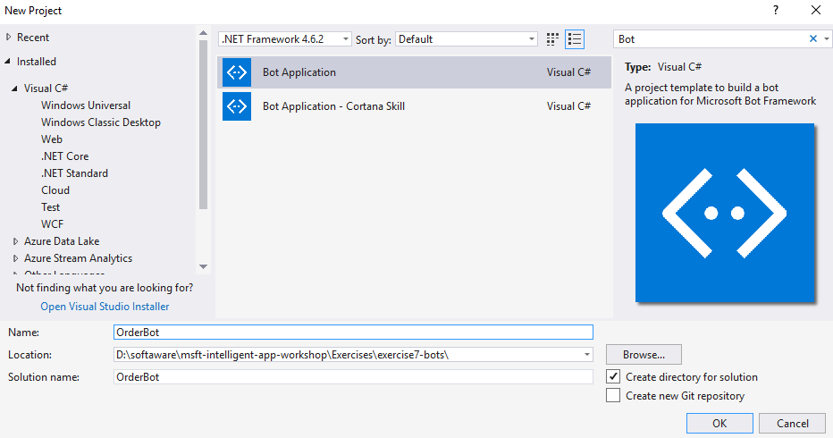
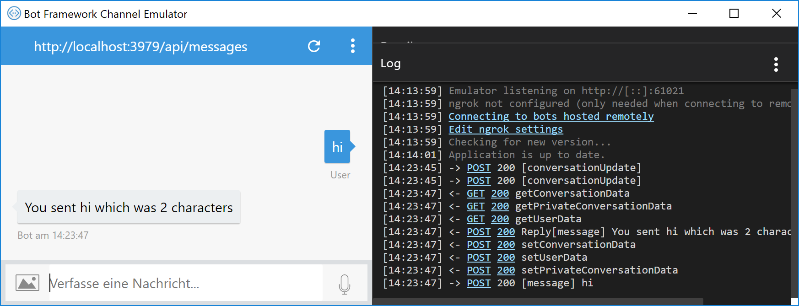
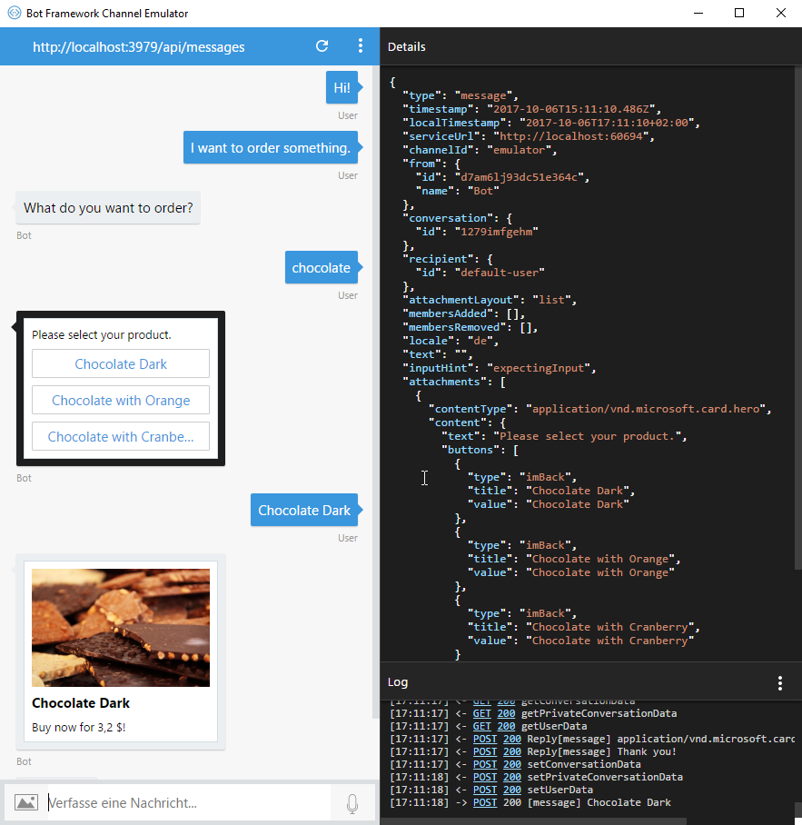

# Bots

## Introduction
The customers of WWI can order items through the WWI online portal. It became a complex website over the last years with many features to search, re-order and compare articles. The website is excellent for handling big orders - but sometimes customers only want to buy one article as quick as possible. The website with its check out wizard is too complicated for those scenarios.

> Discuss, when and where bot applications could be an alternative.

## Conclusions
WWI wants to provide a chat bot for customers to order items within their favorite communication channel, e.g. Skype, Messenger, Slack or Cortana.

## Create a Hello, world-Bot

### Installation

* The [Microsoft Bot Framework](https://dev.botframework.com) is provided as a *NuGet package*
* There are *project templates* available for Visual Studio:
  * Download from [Bot Framework SDK and tools](https://docs.microsoft.com/en-us/bot-framework/dotnet/bot-builder-dotnet-quickstart)
  * Copy the ZIP files to the corresponding folders (e.g. _%userprofile%\documents\Visual Studio 2017\Templates\ProjectTemplates\Visual C#_); see notes in previous link
* Download the *Bot Framework Channel Emulator* and execute the setup
  * [BotFramework-Emulator](https://github.com/Microsoft/BotFramework-Emulator/releases)

### Create a new project
* Create a new project with the **Bot Application** template and call it **OrderBot**



* Update the **Microsoft.Bot.Builder** NuGet package to the newest version.

### Hello, Bot
* The project template already provides a small bot implementation, take a look at *Controllers/MessagesController.cs*

```csharp
public async Task<HttpResponseMessage> Post([FromBody]Activity activity)
{
    if (activity.Type == ActivityTypes.Message)
    {
        await Conversation.SendAsync(activity, () => new Dialogs.RootDialog());
    }
    else
    {
        HandleSystemMessage(activity);
    }
    var response = Request.CreateResponse(HttpStatusCode.OK);
    return response;
}
```

* The Post action refers to the existing *RootDialog* (*Dialogs/RootDialog*)

```cs
[Serializable]
public class RootDialog : IDialog<object>
{
    public Task StartAsync(IDialogContext context)
    {
        context.Wait(MessageReceivedAsync);

        return Task.CompletedTask;
    }

    private async Task MessageReceivedAsync(IDialogContext context, IAwaitable<object> result)
    {
        var activity = await result as Activity;

        // calculate something for us to return
        int length = (activity.Text ?? string.Empty).Length;

        // return our reply to the user
        await context.PostAsync($"You sent {activity.Text} which was {length} characters");

        context.Wait(MessageReceivedAsync);
    }
}
```

### Execute the bot
* Start your web application
* Copy the deployment url (e.g. http://localhost:3979/)
* Start the **Bot Framework Channel Emulator**
* Set the endpoint URL to the address with appended */api/messages* 
* Start chatting



## Creating an Order bot
* The most difficult part of creating a bot is to recognize, what the user was asking for. We won't concentrate on that part during the lab - but take a look at [Language Understanding Intelligent Service (LUIS)](https://luis.ai) for a more sophisticated version.

> You can find a bot version with a .NET Standard library and Entity Framework Core 2 in this Repository ([OrderBotWithEF](OrderBotWithEF)). This step-by-step guide will more concentrate more on the bot development though.

### Create a data manager
* Create a *Data* folder in your project
* Copy the [DataManager.cs](https://github.com/software-architects/msft-intelligent-app-workshop/blob/master/Exercises/exercise7-bots/OrderBot/OrderBot/Data/DataManager.cs) with some test data and a model class ```Stockitem```.

### Create a StockItemSelectionDialog
* A [dialog](https://docs.microsoft.com/en-us/bot-framework/dotnet/bot-builder-dotnet-dialogs) can be used to model a conversation. Each dialog is responsible for a specific answer - it can be a number, a string or a complex type. In our case we want to create a dialog that asks the user to search for a stock item.
* Create a new class *Dialogs/StockItemSelectionDialog*
* Add a ```Serializable``` attribute and implement the ```IDialog<Stockitem>``` interface

```cs
[Serializable]
public class StockItemDialog : IDialog<Stockitem>
```

* Implement the *StartAsync* method. You can use the *PromptString* class to ask the user for an input. The second parameter is an alternative question that would be asked if the first input leads to an error. Whenever the user has answered the question, the *OnStockitemNameReceivedAsync* callback gets called.

```cs
public async Task StartAsync(IDialogContext context)
{
    var dialog = new PromptDialog.PromptString("What do you want to order?", "Please tell me the name of the product.", 3);

    context.Call(dialog, OnStockitemNameReceivedAsync);

    return Task.CompletedTask;
}
```

* Implement the *OnStockitemNameReceivedAsync* method
* The following parts should be discussed in more detail:
  * We send a typing message to the client, so that the user knows, that we are working on an answer.
  * Depending on the result of our product query we are asking different questions. If our search retrieves more than one result we provide a list of options to the user.
  * As soon as exactly one stock item is selected, we show a hero card with an image.

```cs
private async Task OnStockitemNameReceivedAsync(IDialogContext context, IAwaitable<string> result)
{
    var stockitemName = await result;

    // send typing message
    var typingMessage = context.MakeMessage();
    typingMessage.Type = ActivityTypes.Typing;

    await context.PostAsync(typingMessage);

    await Task.Delay(3000);

    // get results
    var dataManager = new DataManager();
    var stockItems = await dataManager.GetStockitemsAsync(stockitemName);

    if (stockItems.Count == 0)
    {
        var dialog = new PromptDialog.PromptString("Sorry, we didn't find this article. What is its name?", "Sorry. What product did you mean?", 3);

        context.Call(dialog, OnStockitemNameReceivedAsync);
    }
    else if (stockItems.Count == 1)
    {
        await SendOrderConfirmationAsync(context, stockItems.First());
    }
    else
    {
        var dialog = new PromptDialog.PromptChoice<Stockitem>(stockItems, "Please select your product.", "Please select.", 3);

        context.Call(dialog, OnStockItemReceivedAsync);
    }
}

private async Task OnStockItemReceivedAsync(IDialogContext context, IAwaitable<Stockitem> result)
{
    var stockitem = await result;

    await SendOrderConfirmationAsync(context, stockitem);
}

private async Task SendOrderConfirmationAsync(IDialogContext context, Stockitem stockitem)
{
    var card = new HeroCard()
    {
        Title = stockitem.StockItemName,
        Text = $"Buy now for {stockitem.RecommendedRetailPrice} $!",
        Images = new List<CardImage>()
        {
            new CardImage()
            {
                Url = stockitem.ImageUrl,
                Tap = new CardAction(ActionTypes.OpenUrl, "Open", null, "https://docs.microsoft.com/en-us/sql/sample/world-wide-importers")
            }
        }
    };

    var responseMessage = context.MakeMessage();
    responseMessage.Attachments.Add(card.ToAttachment());

    await context.PostAsync(responseMessage);

    context.Done(stockitem);
}
```

## Modify the RootDialog
* Finally change the *MessageReceivedAsync* method of the *RootDialog*: if the given sentences contains the word *order*, we start the *StockItemDialog* in our conversation.

```cs
private async Task MessageReceivedAsync(IDialogContext context, IAwaitable<object> result)
{
    var activity = await result as Activity;
            
    if (activity.Text.Contains("order"))
    {
        context.Call(new StockItemDialog(), OnStockItemReceivedAsync);
    }
}

private async Task OnStockItemReceivedAsync(IDialogContext context, IAwaitable<Stockitem> result)
{
    await context.PostAsync("Thank you!");

    context.Wait(MessageReceivedAsync);
}
```

### Execute the bot
* Start your web application
* Copy the deployment url (e.g. http://localhost:3979/)
* Start the **Bot Framework Channel Emulator**
* Set the endpoint URL to the address with appended */api/messages* 
* Start chatting


